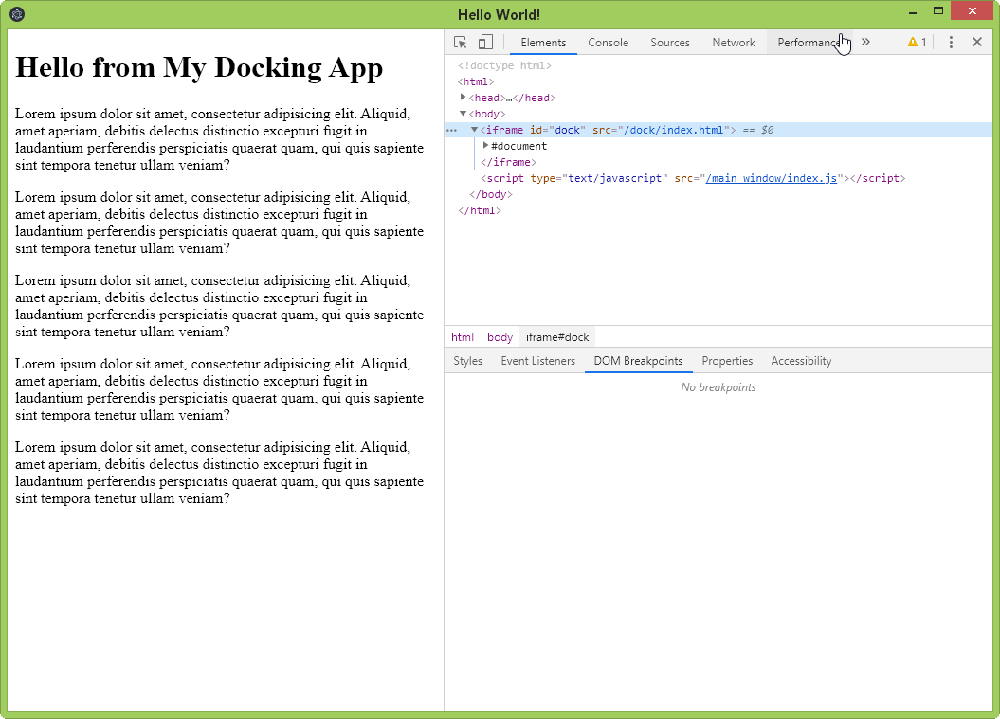

# Electron Iframe Dock Application

Rapid Electron development for  HTML5 apps.

How to do:
- clone this repository
- drop your ready (compiled) HTML5-app in `src/dock` folder (use index.html)

Then use standard NPM scripts in terminal
- `npm install`
- `npm run start` for test
- `npm rum make` for build Electron application

## How it works?

Your HTML app run in borderless iframe inside Electron application.

You can connect Electron host and your page through window.postMessage API

## Why?

You can develop Electron host application and your HTML5-app as independent projects.

You can fast switch your app in dock for any other project.

HTML5-app in 'dock' is completely isolated from Node/Electron.
